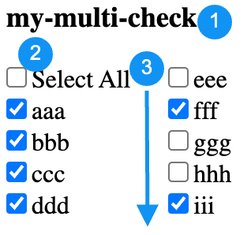

# TypeScript React Multi-Check Challenge

## Notice

This is a simplified component from a real project.
When you approach this task, treat it as a real assignment, showcasing your best programming practices. Your code will be reviewed and evaluated by other engineers on the team you are joining.

Your code will have higher evaluation if:

1. You split the task into smaller sub-tasks and commit each sub-task separately with meaningful commit messages.
1. You ensure that the code is clean, easy to read, and well-organized.
1. You choose names for variables and functions thoughtfully, reflecting their purpose.
1. You create small, meaningful functions for complex logic, promoting maintainability.
1. You adhere to good code formatting practices with no typos.
1. You develop meaningful test cases covering critical functionality.
1. You provide comments where necessary to explain complex sections and minimize unnecessary comments, focusing on code improvement.

## Task

Implement a TypeScript React function component.

1. **Tech Stack:**
   * TypeScript + React
   * Use Jest for unit tests
1. **GitHub Workflow:**
   * Utilize GitHub pull requests for code submission.
1. **Component Requirements:**

   
   1. The component includes a label.
   1. Special `Select All` option behavior:
      * Checked: All other options are checked.
      * Unchecked: All other options are unchecked.
      * Checked if and only if all other options are checked.
      * Unchecked if any other option is unchecked.
   1. Options support multiple columns from top to bottom.

1. **Performance Requirement:**
   * Add proper React hooks in the component to optimize unnecessary executions or renders.

## Development:

```bash
npm install
npm run dev
```

## Testing:

```bash
npm test
```

**Additional Notes:**
1. Use native HTML checkboxes (`<input type="checkbox" />`) as the base, the style doesn't need to be exactly the same.
1. Focus testing efforts on `MultiCheck` and related components and code. No need to test `App.tsx`.
1. Adhere to best TypeScript practices throughout the development process.
